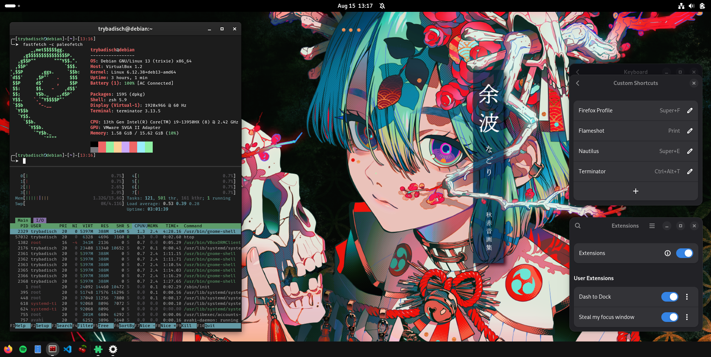
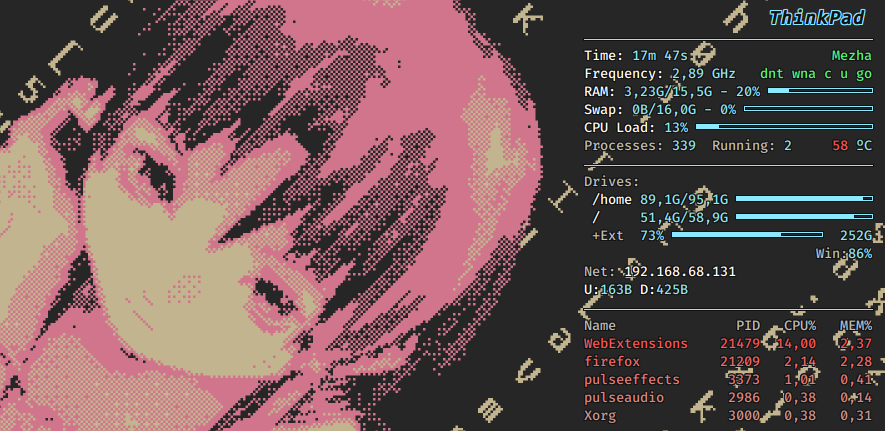

# Gnome
Make Gnome somewhat usable on Debian 13.



### Extensions:
- [dash-to-dock](https://extensions.gnome.org/extension/307/dash-to-dock/)
- [steal-my-focus-window](https://extensions.gnome.org/extension/6385/steal-my-focus-window/)

### QoL settings:
- Load [dash-to-dock.dconf](dash-to-dock.dconf) file:
```shell
dconf load /org/gnome/shell/extensions/dash-to-dock/ < dash-to-dock.dconf
```
- Disable notifications (Do not disturb):
```shell
dconf write /org/gnome/desktop/notifications/show-banners false
```
- Disable alert bell
```shell
dconf write /org/gnome/desktop/sound/event-sounds false
```
- Enable Adwaita-dark theme for GTK applications:
```shell
sudo apt install gnome-themes-extra-data
dconf write /org/gnome/desktop/interface/gtk-theme "'Adwaita-dark'"
```

# ThinkPad [Conky](.config/conky/conky.conf)


# [Terminator](.config/terminator/config)
### Shortcuts
- New tab = `ctrl+t`
- Split pane horizontally = `ctrl+alt+h`
- Split pane vertically = `ctrl+alt+v`
- Close tab = `ctrl+w`
- Scroll up = `shift+up`
- Scroll down = `shift+down`
- Close window = `ctrl+q`
- Zoom pane = `ctrl+shift+z`
- Scaled zoom = `ctrl+shift+x`
- Group/ungroup all panes = `super+g`
- New window = `ctrl+n`

# Zsh

### Plugins:
- [zsh-autosuggestions](https://github.com/zsh-users/zsh-autosuggestions)
- colored-man-pages

### Oh-My-Zsh [theme](.oh-my-zsh/custom/themes/gnzh-custom.zsh-theme)

